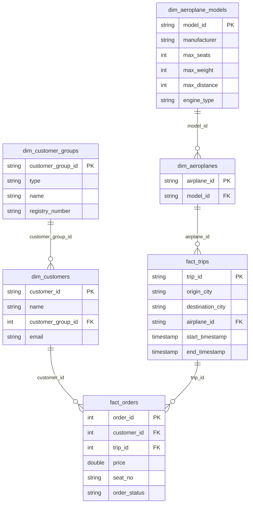
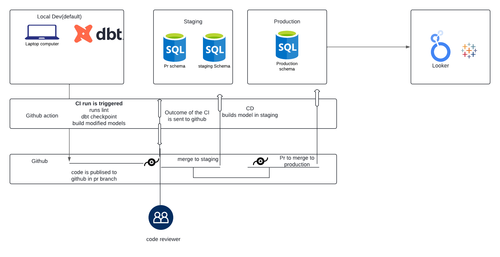

## Air Boltic Data Modeling and Analysis

# Project Overview
This project involves designing a data model for Air Boltic, a hypothetical marketplace for sharing aeroplane rides. The primary goal is to enable monitoring and self-service analysis of the service, which includes understanding customer behavior, tracking trip data, aeroplane utilization, and revenue generation.

The data model is designed using normalization techniques to ensure scalability, maintainability, and data integrity as the service grows.

### ER Diagram

## Data Model Design
The data model is structured to support scalable analytics by organizing the data into fact and dimension tables. It uses a normalized design to ensure minimal redundancy and high data integrity.

### Fact and Dimension Tables
#### Fact Table:

`fact_orders`: Contains transactional data related to orders placed by customers for specific trips.

`fact_trips`: Contains detailed trip information including origin, destination, and aircraft used

#### Dimension Tables:

`dim_customers`: Describes customers and their associated customer groups. 

`dim_aeroplanes`: Describes the specific aeroplanes used for trips, linked to the aeroplane models.

`dim_aeroplane_models`: Describes general aeroplane models and their specifications (manufacturer, max seats, etc.).

## Staging, Intermediate, and Mart Layers
The models are structured across three layers in the dbt framework:

`Base (Staging) Layer`: 
The goal of staging is the raw data is now clean and usable, we trust the data due to the tests and the column names give better, more informative context to the data. Data should be thoroughly tested at this layer to ensure we are confident in the data we are using. This means EVERY staging table in use should have a 1:1 mapping with a raw table. Staging is the only layer that should ever use the source macro, all other layers should use ref.

Here **VERY LIGHT** transformations take place like:
- Unioning tables (assuming the exact same table exists across multiple regions)
- Renaming columns (99% of any renaming should take place here not at a higher level)
- Casting columns (every column should be cast to define its data type)
- Coalescing NULLs, if the NULLs don't carry intrinsic information
- Removing duplicates 

#### Models: 
- stg_air_boltic_customers, 
- stg_air_boltic_orders, 
- stg_air_boltic_trips, 
- stg_air_boltic_aeroplanes,
- stg_air_boltic_aeroplane_models.

`Intermediate (Transform) Layer`: Data sources all have very different schemas as well as conventions that are unique to them. The intermediate layer allows us make changes to the source data in order to prepare it for the mart layer.

#### Models:  
- int_air_boltic_aeroplane_models.

`Mart (Fact and Dimension) Layer`: Business-ready tables used for reporting and analysis.

`Fact Tables`: fact_orders, fact_trips.

`Dimension Tables`: dim_customers, dim_aeroplanes, dim_aeroplane_models, dim_customer_groups

## Key Metrics Supported by the Data Model
#### Daily/Weekly/Monthly Active Users:

`Fact Table`: Can be tracked by querying the Orders Table to see which customers made bookings or completed trips in a given time period. This data can be aggregated to calculate customer activity for any period.

#### Revenue Analysis:

`Fact Table`: The Orders Table includes the price paid by each customer for a trip. Aggregating this data allows for revenue analysis by trip, by customer group, or by time period. For instance, total revenue per month or per trip can be analyzed by joining the Orders and Trips tables.

#### Aeroplane Utilization:

`Dimension + Fact Tables`: The Trips Table contains information about which aeroplanes were used for each trip. Combining this with the Orders Table (to check how many seats were sold per trip) can give insights into aeroplane utilization (e.g., load factor). This provides an understanding of how efficiently each aeroplane is being used.

#### Geographic Trends:

`Dimension Table`: The Trips Table includes origin and destination cities, enabling analysis of which routes are most popular or which regions may need improvement. You can track which routes generate the most revenue or the highest number of bookings.

#### Customer Segmentation:

`Dimension Table`: The Customers Table and Customer Groups Table allow segmentation based on customer type (e.g., private group vs. corporate clients) and performance tracking per customer group. This can be useful for understanding which customer segments are contributing the most revenue or are the most active.

## How This Supports Self-Service Analysis

#### Self-Service Analysis:

This model allows analysts or business users to easily query key performance metrics across various dimensions, such as:

`Customer behavior`: By querying the fact_orders table and joining with dim_customers, analysts can determine which customers are the most active, which customer groups generate the most revenue, or how frequently a customer books trips.

`Geographic trends`: By using the dim_trips table, analysts can easily track which routes or regions are the most profitable or underused. This helps in optimizing route planning and marketing strategies.

`Aircraft utilization`: By joining the dim_trips and dim_aeroplanes tables with the fact_orders table, analysts can track which aeroplanes are being used most efficiently based on the number of bookings per trip and seat availability.

`Revenue metrics`: The fact_orders table allows for detailed revenue analysis, including breakdowns by customer, customer group, or aeroplane. This can be done by aggregating the price field in the Orders Table across various dimensions like time period, trip, or customer group.

`Flexibility`:
This normalized model reduces redundancy and ensures that the dataset can scale as the business grows. It allows users to join different tables (e.g., Orders, Trips, Aeroplanes) to answer complex questions while maintaining data integrity. The separation of dimensions (such as Trips and Customers) from facts (like Orders) provides flexibility in performing various analyses and deriving actionable insights.

# Data Testing and Observability

### Ensuring Data Quality and Observability with Elementary and dbt Project Evaluator

Maintaining high data quality and monitoring the health of a data pipeline are critical to ensuring that downstream analyses and decisions are based on reliable information. In this project, Elementary and dbt Project Evaluator can used to implement data testing and provide robust data observability across the pipeline.

##  Data Testing with Elementary
Elementary provides continuous data quality monitoring across the entire data pipeline. By integrating Elementary into the dbt project, we ensure that all key tables and models are monitored for data anomalies, inconsistencies, and performance degradation.

## Observability with Elementary
Elementary extends beyond traditional data testing by offering real-time data observability.
Observability in this context means gaining insight into the health of the data pipeline through continuous monitoring, automated alerts, and tracking data metrics over time.

## Project Evaluation with dbt Project Evaluator
In addition to data-level testing, the dbt Project Evaluator can be used to assess and monitor the overall health and performance of the dbt project itself. 

## CI/CD

